# TalentLens AI — Architecture Document

> **Version:** 1.0 · **Date:** 2026-08-22  
> **Status:** Current implementation — confirmed from repository source code

---

## 1. Document Overview

### Purpose
This document provides a comprehensive technical architecture reference for **TalentLens AI**, an AI-assisted internal talent intelligence and staffing platform built for GlobalLogic. It describes the actual implemented system — every claim is traceable to source code in this repository.

### Scope
Full-stack web application covering: frontend SPA, backend REST API, AI/LLM integration, database schema, authentication, pipeline management, candidate search and ranking, resource pool, notifications, and export capabilities.

### Intended Audience
Hackathon judges, solution architects, senior developers, technical reviewers, and project stakeholders.

### System Name
**TalentLens AI** — internal talent-matching platform that allows HR and Managers to find, shortlist, and pipeline internal candidates against open Internal Resource Requests (IRCs).

### High-Level Description
TalentLens AI is a single-organisation staffing intelligence tool. Managers define **Projects** with **IRCs** (Internal Resource Requests — job requisitions). An AI-powered search engine, driven by an LLM running locally via Ollama, ranks internal employees against the IRC requirements and the manager's natural-language query. Shortlisted candidates move through a structured **Pipeline** of interview stages. HR has org-wide visibility; Managers see only their own projects; Candidates can apply and track their own progress.

---

## 2. System Context

### User Roles

| Role | Description |
|------|-------------|
| **HR** | Org-wide view of all projects, IRCs, pool, and pipeline. Can import pipeline entries via CSV. |
| **Manager** | View and manage only their own projects, IRCs, and pipeline. Drives AI Search. |
| **Candidate** | Browse Open IRCs, apply, track their own pipeline stage and feedback. |

### External Dependencies

| Dependency | Purpose |
|------------|---------|
| **Ollama REST API** | Local LLM server; hosts the ranking model (`qwen3.5:9b`) and optional embedding model |
| **PostgreSQL** | Primary relational data store |
| **pgvector extension** | Optional vector similarity search pre-filter (Phase 2) |
| **GlobalLogic GLO** | Employee profile portal — linked via `https://glo.globallogic.com/users/profile/{username}` derived from employee email |

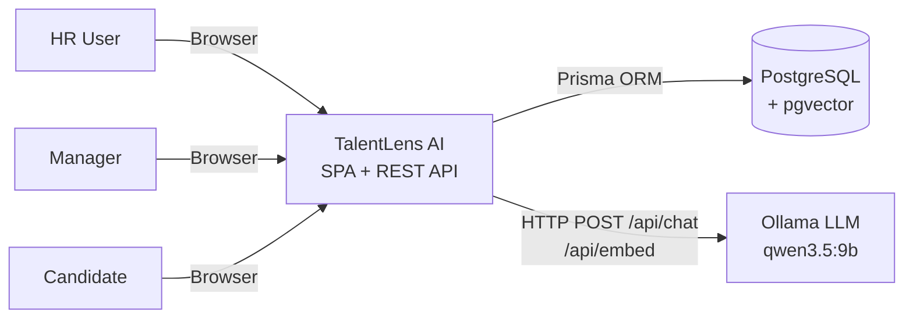

---

## 3. High-Level Architecture

TalentLens AI is a **two-tier web application** composed of a React SPA (client) and a NestJS REST API (server).

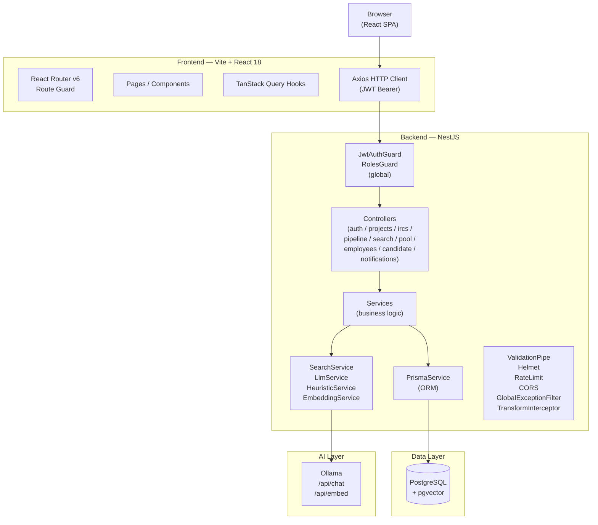

---

## 4. Technology Stack

| Layer | Technology | Version / Notes |
|-------|-----------|-----------------|
| **Frontend Framework** | React | 18.x with TypeScript |
| **Build Tool** | Vite | SPA, no SSR |
| **Frontend Routing** | React Router v6 | `BrowserRouter`, `PrivateRoute` |
| **Server State** | TanStack Query (React Query) | v5, `staleTime=30s`, `retry=1` |
| **HTTP Client** | Axios | `VITE_API_URL` env var, defaults to `http://localhost:3001` |
| **UI Styling** | Tailwind CSS | Utility-first, custom token system |
| **Icons** | lucide-react | SVG icon library |
| **Backend Framework** | NestJS | 10.x with TypeScript |
| **Runtime** | Node.js | Express adapter |
| **ORM** | Prisma | 5.x — type-safe DB client |
| **Database** | PostgreSQL | Primary store |
| **Vector Extension** | pgvector | `vector(768)` on `Employee.embedding` — optional |
| **Authentication** | JWT + Passport.js | `passport-jwt`, 7-day token expiry |
| **Password Hashing** | bcryptjs | Configurable rounds (constant in `auth.constants.ts`) |
| **Validation** | class-validator + class-transformer | Whitelist mode, forbid non-whitelisted |
| **API Documentation** | Swagger / OpenAPI | Available at `/api/docs` |
| **LLM Integration** | Ollama REST API | Model: `qwen3.5:9b` (default), `temperature=0`, JSON-constrained output |
| **PDF Parsing** | pdf-parse | In-memory, JD text extraction |
| **DOCX Parsing** | mammoth | In-memory, JD text extraction |
| **File Upload** | multer | Memory storage, 5 MB limit |
| **LLM Response Validation** | Zod | Schema-safe parsing of ranked candidate arrays |
| **HTTP Security** | helmet | Standard security headers |
| **Rate Limiting** | express-rate-limit | 200 requests per 15-minute window |
| **Config Validation** | Joi | Schema-validated `process.env` at startup |
| **Pool/Search CSV Export** | Built-in string generation (server) + Browser Blob API (client) | No third-party export library |
| **Deployment** | Not determinable from repository | No Docker, CI/CD, or cloud config files found |

---

## 5. Repository / Codebase Structure

```
TalentAI/
├── client/                     # React SPA (Vite + TypeScript)
│   ├── src/
│   │   ├── App.tsx             # Route definitions
│   │   ├── main.tsx            # App entry point — providers: QueryClient, AuthProvider, BrowserRouter
│   │   ├── auth/               # JWT context, PrivateRoute, useAuth hook
│   │   ├── pages/              # Feature pages (search, pipeline, pool, dashboard, etc.)
│   │   │   ├── auth/           # Login/signup page
│   │   │   ├── dashboard/      # Role-specific dashboards + useDashboard hook
│   │   │   ├── search/         # AI Search page, composer, result cards, useAISearch hook
│   │   │   ├── pipeline/       # Kanban board, PipelineCard, usePipeline hook
│   │   │   ├── pool/           # Resource pool table + usePool hook
│   │   │   ├── employees/      # Full candidate profile page
│   │   │   ├── irc-applied/    # HR pipeline list + CSV import
│   │   │   ├── projects/       # Project list + project detail
│   │   │   └── candidate/      # Candidate-facing: open IRCs, my-pipeline, feedback, upcoming
│   │   ├── components/         # Shared UI primitives (Button, Card, Modal, Badge, etc.)
│   │   ├── layout/             # Shell, Sidebar, TopBar
│   │   └── lib/
│   │       ├── api/            # Axios API modules (auth, search, pipeline, pool, etc.)
│   │       ├── constants/      # PIPELINE_STAGES, STAGE_HEX, SKILL_LIST
│   │       └── utils/          # cn() Tailwind helper
│   ├── vite.config.ts
│   └── tailwind.config.ts
│
├── server/                     # NestJS API (TypeScript)
│   ├── src/
│   │   ├── app.module.ts       # Root module — registers all feature modules + global guards
│   │   ├── main.ts             # Bootstrap — CORS, helmet, rate-limit, Swagger, ValidationPipe
│   │   ├── auth/               # Login, signup, demo-login, JWT strategy
│   │   ├── search/             # AI Search orchestration + LLM + heuristic + embedding services
│   │   ├── pipeline/           # Stage management, feedback, stage history
│   │   ├── projects/           # Project listing and IRC summary
│   │   ├── ircs/               # Single IRC detail endpoint
│   │   ├── employees/          # Full employee profile (role-aware)
│   │   ├── pool/               # Resource pool listing + CSV export
│   │   ├── candidate/          # Candidate-facing routes (apply, my-pipeline, feedback)
│   │   ├── notifications/      # In-app notification delivery + mark-seen
│   │   ├── health/             # Health check endpoint
│   │   ├── prisma/             # PrismaService singleton
│   │   ├── config/             # configuration.ts — maps env vars to typed config keys
│   │   └── common/
│   │       ├── constants/      # pipeline.constants.ts, search.constants.ts, auth.constants.ts
│   │       ├── decorators/     # @CurrentUser, @Roles, @Public
│   │       ├── guards/         # JwtAuthGuard, RolesGuard
│   │       ├── filters/        # GlobalExceptionFilter
│   │       ├── interceptors/   # TransformInterceptor — wraps all responses in { data: ... }
│   │       └── utils/          # search-logger.util.ts — debug file logging
│   ├── prisma/
│   │   ├── schema.prisma       # Full database schema
│   │   ├── seed.ts             # Seeder with demo users + sample data
│   │   └── migrations/         # Prisma migration history
│   └── logs/                   # Search debug log files (server/logs/latest-candidate-pool.json)
│
├── specs/                      # Product and business-rules specs
├── skills/                     # Engineering skills guides
└── docs/
    └── ARCHITECTURE.md         # This document
```

---

## 6. Frontend Architecture

### Entry Point
`client/src/main.tsx` — renders the React tree with three providers:
1. `BrowserRouter` — React Router v6 history
2. `QueryClientProvider` — TanStack Query, `staleTime=30s`, `retry=1`
3. `AuthProvider` — JWT user state from `localStorage`

### Routing (`App.tsx`)
All routes except `/login` are wrapped in `PrivateRoute`, which redirects unauthenticated users to `/login`. Once authenticated, routes are rendered inside the `Shell` layout (sidebar + topbar). Role-specific dashboard rendering is handled by `RoleDashboard`.

```
/login                → LoginPage (public)
/dashboard            → RoleDashboard (HR | Manager | Candidate)
/search               → AISearchPage
/pipeline             → PipelinePage (Kanban board)
/pool                 → ResourcePoolPage
/irc-applied          → IRCAppliedPage (tabular pipeline view)
/projects             → AllProjectsPage
/projects/:id         → ProjectDetailPage
/employees/:id        → CandidateProfilePage
/open-ircs            → OpenIRCsPage (candidate only)
/my-pipeline          → MyPipelinePage (candidate only)
/feedback             → MyFeedbackPage (candidate only)
/upcoming             → UpcomingPage (candidate only)
```

### State Management
No global store (no Redux/Zustand). All server state is managed by **TanStack Query**:
- Query keys are hierarchical (e.g., `['pipeline', 'board', params]`)
- Optimistic updates used in pipeline mutations (advance/reject)
- `placeholderData: prev` keeps stale data visible during re-fetches

### Authentication State
`AuthContext` (React Context) holds `token`, `user`, `login()`, `logout()`. On load, the stored `localStorage` JWT is decoded client-side to check expiry. The Axios interceptor attaches `Authorization: Bearer <token>` on every request and auto-redirects on 401 (except auth endpoints).

### API Layer (`client/src/lib/api/`)
Each feature has a dedicated typed module:

| Module | Base Path |
|--------|-----------|
| `auth.api.ts` | `/auth` |
| `search.api.ts` | `/search` |
| `pipeline.api.ts` | `/pipeline` |
| `pool.api.ts` | `/pool` |
| `projects.api.ts` | `/projects` |
| `employees.api.ts` | `/employees` |
| `candidate.api.ts` | `/candidate` |

### Data Flow Pattern
```
User interaction
  → local component state
  → TanStack Query mutation/query (typed hook)
  → apiClient.{method}(url, dto)   [Axios + JWT header]
  → Backend REST API
  → response (wrapped in { data: ... } by TransformInterceptor)
  → Query cache update / optimistic update
  → React re-render
```

### Key Frontend Components

| Component | Purpose |
|-----------|---------|
| `SearchComposer` | Project/IRC selector, query input, multiple JD file attachment (up to 5 PDF/DOCX files; per-file chips with individual remove) |
| `ResultCard` / `ResultTable` | Ranked candidate display with match%, whyRecommend, whyNot, GLO profile link via employee email |
| `PipelineCard` | Kanban card — advance/revert/reject/feedback actions; inline feedback history via `feedbackRounds` from list response |
| `PipelinePage` | Full Kanban board grouped by pipeline stage |
| `FeedbackHistoryModal` | Per-candidate feedback history popup |
| `EmployeeProfileModal` | Inline profile popup from search results |
| `CandidateProfilePage` | Full profile page `/employees/:id` |
| `HRDashboard` / `ManagerDashboard` | Role-scoped KPI + funnel + project list; clickable KPI cards deep-link to `/pipeline?stage=X` and `/pool?benchStatus=X` |
| `CandidateDashboard` | Candidate-facing KPIs and recent applications |
| `StepProgress` | Live search progress indicator during LLM ranking |

---

## 7. Backend Architecture

### Entry Point (`main.ts`)
The NestJS bootstrap registers the following in order:
1. **CORS** — any `localhost:*` origin allowed (dev convenience via dynamic origin function)
2. **Helmet** — security headers
3. **Rate Limiting** — 200 req / 15 min window
4. **ValidationPipe** — whitelist + forbidNonWhitelisted + transform
5. **GlobalExceptionFilter** — normalises all errors to a consistent shape
6. **TransformInterceptor** — wraps all success responses in `{ data: T }`
7. **Swagger** — available at `/api/docs`

### Global Guards (`app.module.ts`)
Every route is protected by two `APP_GUARD` providers unless decorated with `@Public()`:
- `JwtAuthGuard` — validates Bearer token, hydrates `request.user`
- `RolesGuard` — enforces `@Roles(...)` decorator

### Feature Modules

| Module | Controller | Service(s) | Description |
|--------|-----------|------------|-------------|
| `AuthModule` | `AuthController` | `AuthService`, `JwtStrategy` | Login, signup, demo-login |
| `SearchModule` | `SearchController` | `SearchService`, `LlmService`, `HeuristicService`, `EmbeddingService` | AI-ranked candidate search |
| `PipelineModule` | `PipelineController` | `PipelineService` | Stage movement, feedback, stage history; pipeline list now includes `feedbackRounds` and `employee.email` |
| `ProjectsModule` | `ProjectsController` | `ProjectsService` | Project + IRC listing |
| `IrcsModule` | `IrcsController` | `IrcsService` | Single IRC detail |
| `EmployeesModule` | `EmployeesController` | `EmployeesService` | Employee profile (role-aware) |
| `PoolModule` | `PoolController` | `PoolService` | Resource pool + CSV export |
| `CandidateModule` | `CandidateController` | `CandidateService` | Candidate-facing endpoints |
| `NotificationsModule` | `NotificationsController` | `NotificationsService` | In-app notifications |
| `HealthModule` | `HealthController` | — | Basic health check |
| `PrismaModule` | — | `PrismaService` | Prisma client singleton |

### Backend Component Interaction

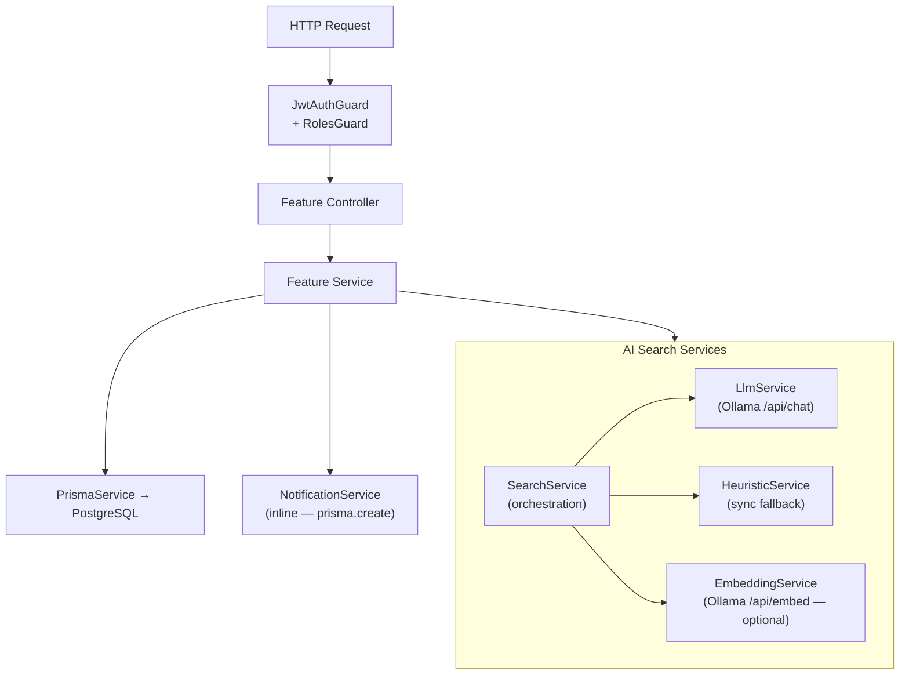

---

## 8. Authentication & Authorization Architecture

### Login Mechanism
Email + bcrypt-hashed password. Constant-time comparison on both found and not-found cases (prevents user enumeration).

### Token
- Format: RS256 → actually **HS256** signed JWT using `JWT_SECRET`
- Payload: `{ sub: userId, email, role, name, employeeId? }`
- Expiry: 7 days (`JWT_EXPIRY` constant)
- Storage: `localStorage` on the client

### Token Validation
Every API request (except `@Public()` routes) passes through `JwtAuthGuard`, which invokes `JwtStrategy.validate()`. This performs a **live database lookup** to confirm the user still exists and their role hasn't changed.

### Role-Based Access
`RolesGuard` reads the `@Roles(...)` decorator from the handler and compares against `request.user.role`. The three roles are defined in the Prisma `Role` enum: `manager`, `hr`, `candidate`.

Key role boundaries (R18–R20):
- **Manager**: sees only their own projects, can only shortlist into their own IRCs
- **HR**: sees all projects, IRCs, pool, and pipeline entries
- **Candidate**: can only access `/candidate/*` routes, cannot see other employees' pipeline status

### Demo Login
`POST /auth/demo-login/:role` — no password required; issues a JWT for a seeded demo user. Documented as dev/demo convenience only (R22).

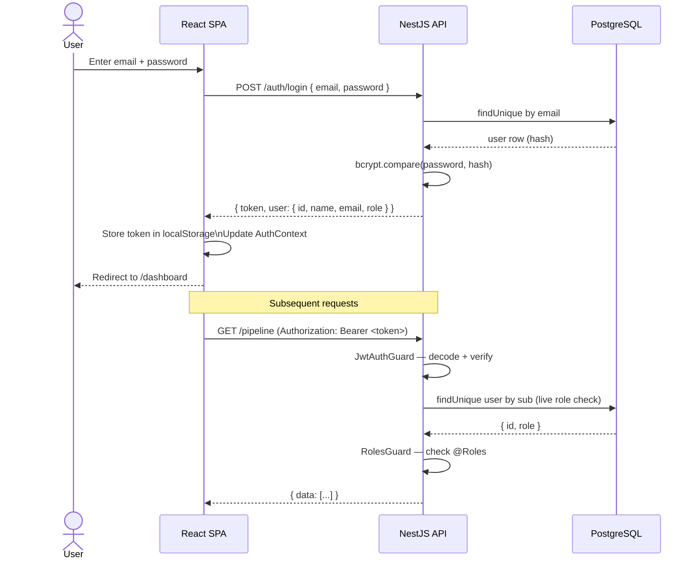

---

## 9. Domain Model

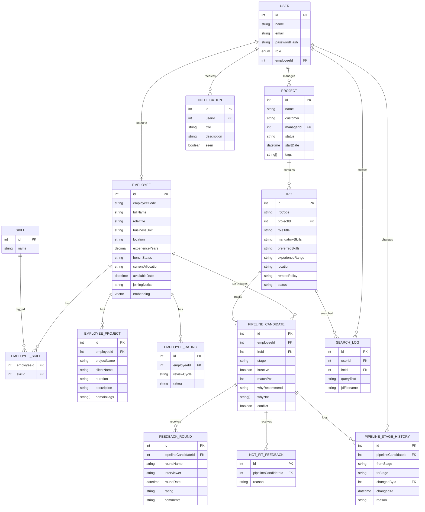

---

## 10. Database Architecture

### Technology
**PostgreSQL** with the **pgvector** extension for optional vector similarity search.

### Key Tables and Relationships

| Table | Purpose |
|-------|---------|
| `User` | Authentication accounts; linked to an `Employee` record optionally |
| `Employee` | Internal talent profile — skills, experience, location, bench status, pgvector embedding |
| `Skill` | Normalised skill name dictionary |
| `EmployeeSkill` | M:N join: employee ↔ skill |
| `EmployeeProject` | Career history entries per employee |
| `EmployeeRating` | Performance ratings (Exceeding / Meeting / Below) |
| `Project` | Client delivery project; owned by a manager |
| `Irc` | Internal Resource Request (job requisition) scoped to a project |
| `PipelineCandidate` | One row per active pipeline entry. `@@unique([employeeId, ircId, isActive])` enforces R4. |
| `FeedbackRound` | Interview feedback attached to a pipeline entry |
| `NotFitFeedback` | Rejection reason when a candidate is marked not a fit |
| `PipelineStageHistory` | Immutable audit trail of every stage change |
| `Notification` | In-app notifications delivered to a user |
| `SearchLog` | Records every search execution (user, IRC, query text, JD filename) |

### Uniqueness Constraint
`PipelineCandidate.@@unique([employeeId, ircId, isActive])` — allows one active (`isActive=true`) and multiple archived (`isActive=false`) records for the same employee/IRC pair. This supports the reactivation flow (R15a).

### pgvector Column
`Employee.embedding` is typed as `vector(768)` (Unsupported Prisma type — managed via raw SQL migrations). Written only by `EmbeddingService`. Null until a bulk embed job runs. The 768-dimension default matches `nomic-embed-text`.

### Prisma Migrations
Five migrations in `server/prisma/migrations/`:
1. `20260813090247_init` — initial schema
2. `20260813093530_init` — adjustments
3. `20260814120000_add_pgvector` — pgvector extension
4. `20260816000000_add_employee_embedding` — `embedding vector(768)` column
5. `20260819100345_add_stage_feedback_fields` — stage feedback enrichments

---

## 11. AI Search Architecture

The AI Search module (`server/src/search/`) is the most architecturally significant feature. It is built as a **four-service split**:

| Service | Responsibility |
|---------|---------------|
| `SearchService` | Orchestration: pool building, ranking dispatch, re-hydration, deduplication checks, logging |
| `LlmService` | Prompt construction, Ollama API call, Zod response validation, JSON sanitisation, one retry |
| `HeuristicService` | Synchronous skill-overlap fallback — used when LLM fails or `RANKING_PROVIDER=heuristic` |
| `EmbeddingService` | Optional pgvector pre-filter — embeds employee profiles and queries for similarity search |

### Search Execution Flow (8 Steps)

```
Step 1:  Load IRC + Project from DB → validate status = 'Open' (R2)
Step 1.5: If query present AND IRC/JD has context → LLM query scope validation
Step 2:  Build candidate pool
         ├── scope='applied': only employees already in this IRC's active pipeline
         └── scope='all':    all employees EXCEPT those Rejected for this IRC
         Optional: pgvector pre-filter if EMBEDDING_PROVIDER != 'none' AND pool > VECTOR_PRE_FILTER_LIMIT
Step 3:  Rank pool
         ├── RANKING_PROVIDER='llm': call LlmService.rank() 
         │   └── on any failure: fall back to HeuristicService.rank()
         └── RANKING_PROVIDER='heuristic': directly use HeuristicService.rank()
Step 4:  Re-hydrate — fetch ALL display fields from DB (fullName, roleTitle, skills, etc.)
         Never trust model output for display fields
Step 5:  Duplicate check (R5) — flag employees active in a DIFFERENT open IRC
Step 6:  In-pipeline check (R4) — flag employees already in THIS IRC's pipeline
Step 7:  Assemble results; sort by matchPct DESC
Step 8:  Write SearchLog to DB; write debug entry to server/logs/latest-candidate-pool.json
```

### LLM Prompt Construction
The ranking prompt contains:
- `MANAGER REQUEST` — the user's natural-language query (highest priority)
- `ROLE CONTEXT` — IRC fields: roleTitle, mandatorySkills, preferredSkills, experienceRange, location, remotePolicy, projectStartDate
- `JOB DESCRIPTION` — extracted JD text (if provided), capped at `JD_TEXT_MAX_LENGTH` characters
- `CANDIDATE POOL` — array of candidates: skills, experienceYears, currentAllocation, availableDate, joiningNotice, projectHistory

The prompt instructs the model through 10 explicit steps (interpret → filter → eligible set → rank → factual grounding → score → whyRecommend → whyNot → availability → final validation).

### LLM Call Parameters
```json
{
  "model": "qwen3.5:9b",
  "stream": false,
  "think": false,
  "format": "{ JSON Schema for array of ranked items }",
  "options": {
    "temperature": 0,
    "seed": 42,
    "num_ctx": 16384,
    "num_predict": 4000
  }
}
```
`temperature=0` + fixed seed = deterministic output for same input.

### Scoring Scale
| Range | Meaning |
|-------|---------|
| 90–100 | Direct project evidence of substantially the same work |
| 80–89 | Very strong adjacent project evidence |
| 70–79 | Solid relevant evidence with a meaningful gap |
| 55–69 | Useful overlap but incomplete project evidence |
| 40–54 | Mostly skill-level relevance |
| 20–39 | Weak project relevance |
| 0–19 | Very weak evidence |

Heuristic fallback is capped at 85% (never fully displaces LLM evidence-based scores, R6).

### Query Scope Validation
Before ranking, if the manager provides a query AND the IRC/JD has skill context, `LlmService.validateQuery()` checks:
- Is this a candidate-evaluation query? (domain check)
- Do any named skills in the query match the IRC/JD? (skill check)
- Do numeric constraints contradict the IRC? (numeric check)

IRC skills are always authoritative over JD skills when both exist. If validation fails, `422 Unprocessable Entity` is returned with a reason. If the validation LLM call itself fails, the search proceeds unblocked.

---

## 12. AI Search End-to-End Sequence Diagram

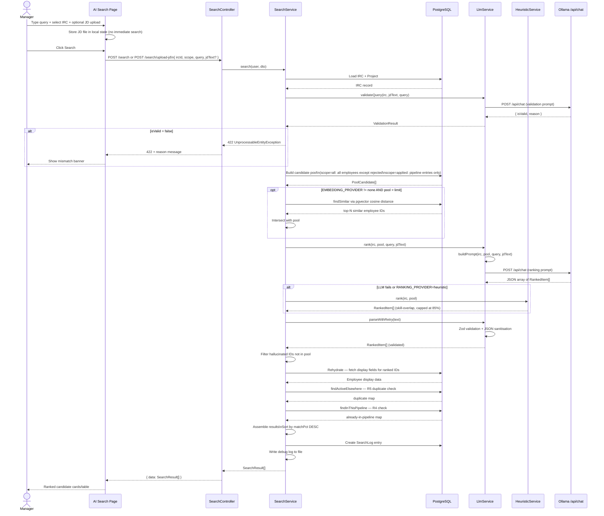

---

## 13. Candidate Ranking Architecture

### Deterministic Filtering (Database Layer)
Performed **before** the LLM:
- Scope filter: `applied` → only employees in this IRC's active pipeline
- Exclusion filter: Rejected employees for this IRC are excluded from `scope=all`
- Optional: pgvector cosine similarity pre-filter (when `EMBEDDING_PROVIDER != 'none'`)

### LLM-Based Ranking (AI Layer)
The LLM applies its own filtering AND ranking:
- **Hard filter**: Only candidates explicitly matching the manager's skill request qualify
- **Ranking**: Primarily by project-history evidence depth (not just skill tags)
- **Output per candidate**: `matchPct`, `whyRecommend` (≤25 words), `whyNot` (≤18 words), `conflict`, `conflictNote`

### Post-Ranking Enrichment (Application Layer)
After the LLM responds:
- **Re-hydration**: Display fields (fullName, roleTitle, location, skills) always come from the database — never from model output
- **Hallucination guard**: `employeeId` values not present in the submitted pool are silently dropped
- **Duplicate flag** (R5): `isDuplicate=true` when the employee is active in another open IRC
- **Pipeline flag** (R4): `alreadyInPipeline=true` when already in this IRC's pipeline
- **Sort**: Final results sorted by `matchPct DESC`

### Ranking Context Priority
1. **Manager query** — PRIMARY signal; explicit skill/constraint in query = hard filter
2. **IRC role context** — provides secondary ranking differentiation
3. **JD text** — supplementary context; IRC is always authoritative when conflict exists

---

## 14. Search Context Priority

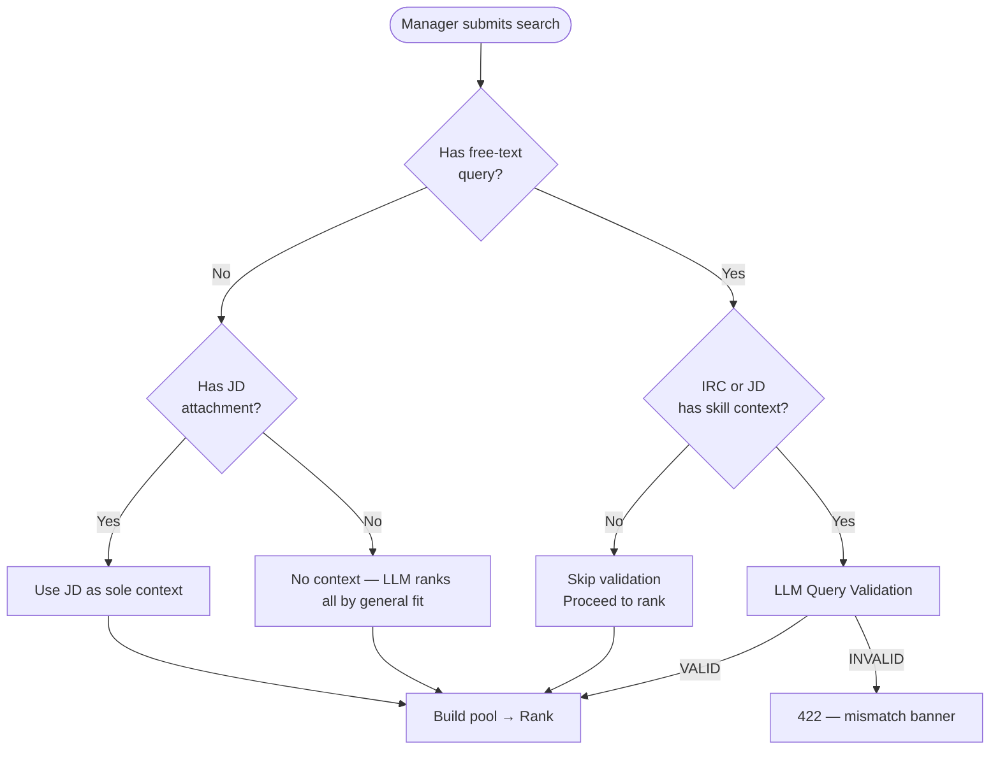

| Scenario | Behaviour |
|----------|-----------|
| IRC with skills, no query | LLM ranks all pool candidates by role fit |
| Manager query only | Query drives filtering; IRC provides background context |
| Manager query + JD | Query is primary; JD refines context; IRC is authoritative over JD |
| JD only (no query) | JD text is the effective query |
| Out-of-scope query | LLM validation returns `422` with human-readable reason before ranking |
| No IRC context + no JD | All candidates ranked; validation skipped |

---

## 15. File Attachment Architecture

Supported file types: **PDF** and **DOCX** (`.docx`), maximum **5 MB per file**, up to **5 files per request**.

```mermaid
sequenceDiagram
    actor Manager
    participant UI as SearchComposer
    participant API as SearchController
    participant Parser as pdf-parse / mammoth
    participant SS as SearchService

    Manager->>UI: Attach 1–5 PDF/DOCX files
    UI->>UI: Validate extension + MIME type per file\nSkip duplicates by name\nStore File[] in local state (no upload yet)
    Manager->>UI: Click Search
    UI->>API: POST /search/upload-jd (multipart/form-data)\n{ files[], ircId, scope, query? }
    API->>API: multer FilesInterceptor('files', 5)\nMemory storage, 5 MB/file limit\nFilter: only PDF/DOCX MIME types
    loop Each file in parallel
        API->>Parser: pdfParse(buffer) or mammoth.extractRawText({buffer})
        Parser-->>API: extracted text string
    end
    API->>API: Join texts with '\n\n---\n\n' separator
    API->>SS: search(user, { ...dto, jdText: combinedText }, 'file1.pdf, file2.docx')
    SS-->>API: SearchResult[]
    API-->>UI: { data: SearchResult[] }
    UI-->>Manager: Ranked candidates; JD chips show each filename
```

### File Handling Notes
- Files are **never persisted to disk** — multer uses `memoryStorage()`
- Text extraction runs in parallel (`Promise.all`) across all uploaded files
- Extracted texts are concatenated with `\n\n---\n\n` as a document boundary separator
- All filenames (comma-joined) are stored in `SearchLog.jdFilename`
- Combined JD text is capped at `JD_TEXT_MAX_LENGTH` characters before inclusion in the LLM prompt
- The UI prevents duplicate file names from being added to the file list

---

## 16. Candidate Filtering Architecture

### Backend Filters (Database Query — `PoolService`)
Applied via Prisma `WHERE` clauses before data is returned:

| Filter | Backend Implementation |
|--------|----------------------|
| `search` | `fullName ILIKE` OR `roleTitle ILIKE` |
| `location` | Exact match |
| `businessUnit` | Exact match |
| `benchStatus` | Exact match (`Bench` / `Allocated`) |
| `forecasted=true` | `availableDate IS NOT NULL` (Allocated employees with a known return date — Forecast to Pool) |
| `minExp` / `maxExp` | `experienceYears BETWEEN` |
| `skills` | All listed skills must be present (multiple `AND some` conditions) |
| `page` / `limit` | Offset pagination |
| `sortBy` / `sortOrder` | `fullName`, `experienceYears`, `benchStatus` |

### Frontend Filters (In-memory — `AISearchPage`)
Applied client-side **after** the AI search returns:

| Filter | Mechanism |
|--------|----------|
| Location | Multi-select dropdown derived dynamically from current result locations (faceted) |
| Pool Status | `InPool` (no availableDate) / `ForecastToPool` (has availableDate) |
| Result count | Show All / Top 5 / Top 10 / Top 50 / Custom (number input) |
| Sort | match%, experience, available date |

### Frontend Filters (In-memory — `usePool`)
`usePool` maps the display value `'ForecastToPool'` to actual backend parameters: `{ benchStatus: 'Allocated', forecasted: true }`. The pool page also supports deep-linking via URL params (e.g., `/pool?benchStatus=Bench`).

### Pipeline Stage Filter (URL param)
`PipelinePage` reads the `stage` URL parameter on mount and pre-selects those stages in the Kanban view. Supports comma-separated values: `/pipeline?stage=Selected,Allocated`.

---

## 17. Dashboard Architecture

### Data Sources
Both `ManagerDashboard` and `HRDashboard` use the shared `useDashboard` hook, which accepts optional `filterProjectId` and `filterIrcId` parameters and fires two parallel queries:
1. `GET /projects` — project list with IRC summaries
2. `GET /pipeline?limit=100[&projectId=X][&ircId=Y]` — up to 100 pipeline entries, optionally scoped

KPI derivations happen **client-side** from these two datasets:

| KPI | Derivation |
|-----|-----------|
| Number of IRCs (Open/Total) | `scopedIrcs.filter(i => i.status === 'Open').length` / `scopedIrcs.length` |
| Active Pipeline | `entries.filter(e => e.stage !== 'Rejected' && e.stage !== 'Allocated').length` |
| Awaiting Review | `entries.filter(e => e.stage === 'AI Shortlisted').length` |
| Positions Filled / Allocated | `entries.filter(e => e.stage === 'Allocated').length` |
| Selected | `entries.filter(e => e.stage === 'Selected').length` |
| Rejected | `entries.filter(e => e.stage === 'Rejected').length` |

### HR-Specific KPIs
`HRDashboard` additionally queries pool counts:
- `GET /pool?benchStatus=Bench&limit=1` → `meta.total` (On Pool)
- `GET /pool?benchStatus=Allocated&forecasted=true&limit=1` → `meta.total` (Forecasted Pool)

### Clickable KPI Cards (Deep-linking)
KPI cards on both dashboards navigate directly to the relevant filtered view:
- **Selected** → `/pipeline?stage=Selected`
- **Allocated** → `/pipeline?stage=Allocated`
- **Rejected** → `/pipeline?stage=Rejected`
- **On Pool** → `/pool?benchStatus=Bench`
- **Forecasted Pool** → `/pool?benchStatus=Allocated`

### Hiring Funnel
Rendered as a horizontal bar chart derived from `PIPELINE_STAGES`. Each stage bar width = `count / max * 100%`. Colour-coded by `STAGE_HEX` constants.

### Manager Scoping
`ProjectsService.findAll()` applies `WHERE managerId = :userId` for managers. The pipeline entries are scoped to their projects via `irc.project.managerId`. No aggregation happens on the server for dashboards — all KPIs are derived client-side.

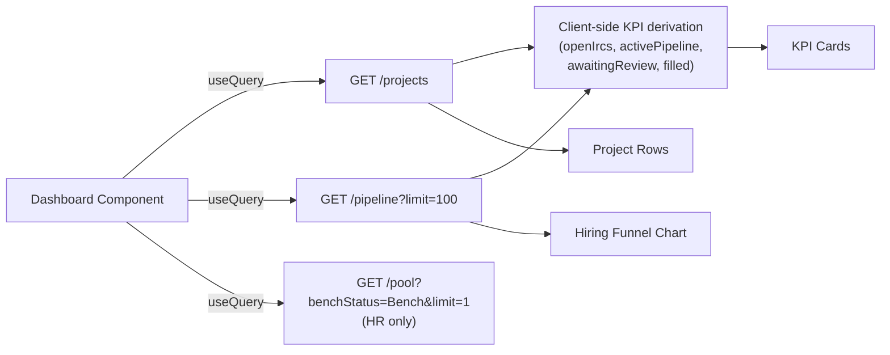

---

## 18. Candidate Pool / Availability Architecture

### Internal vs Display Terminology

| DB Field Value (`benchStatus`) | UI Display |
|-------------------------------|-----------|
| `Bench` | "Available now" / "On Bench" / green indicator |
| `Allocated` | "Allocated" / grey indicator |

### Pool Status in AI Search Results
The search result type includes `availableDate`. The frontend AI Search page derives a pool status display:
- `availableDate = null` → displayed as **In Pool** (currently available)
- `availableDate != null` → displayed as **Forecast to Pool** (available from date)

### Availability Conflict in Pipeline
`conflict=true` is set by the LLM (and enforced by `HeuristicService`) when `candidate.availableDate > project.startDate`. A `conflictNote` is shown as a warning on the result card, never blocking shortlisting.

---

## 19. Pipeline Architecture

### Stage Sequence
```
AI Shortlisted → Screening → Internal Tech Evaluation → Client Interview → Selected → Allocated
                                                                            ↓
                                                                        Rejected (terminal)
```
Defined in `server/src/common/constants/pipeline.constants.ts`.

### Stage Rules
| Rule | Implementation |
|------|---------------|
| R4: one active record per (employee, IRC) | `@@unique([employeeId, ircId, isActive])` DB constraint + service check |
| R12: forward moves exactly one stage | `targetIdx === currentIdx + 1` validation in `PipelineService.updateStage()` |
| R13: backward moves exactly one stage | `targetIdx === currentIdx - 1` + optional reason note |
| R14: rejection requires a reason | `NotFitDto.reason` (MinLength 3) |
| R15a: reactivation creates fresh entry | Original Rejected row preserved; new `AI Shortlisted` entry created |
| R15b: Allocated is terminal | `updateStage()` throws `BadRequestException` if current stage is Allocated |

### Feedback on Stage Advance
On the pipeline Kanban board, advancing a candidate **requires** submitting feedback before the stage change is committed. The feedback modal is shown before calling `updateStage`. Both the `FeedbackRound` creation and the `PipelineCandidate` stage update are sent as two sequential API calls.

### Notifications
After every stage change, shortlist, or rejection, `PipelineService.notify()` creates a `Notification` row for the project manager (if the caller is not the manager themselves).

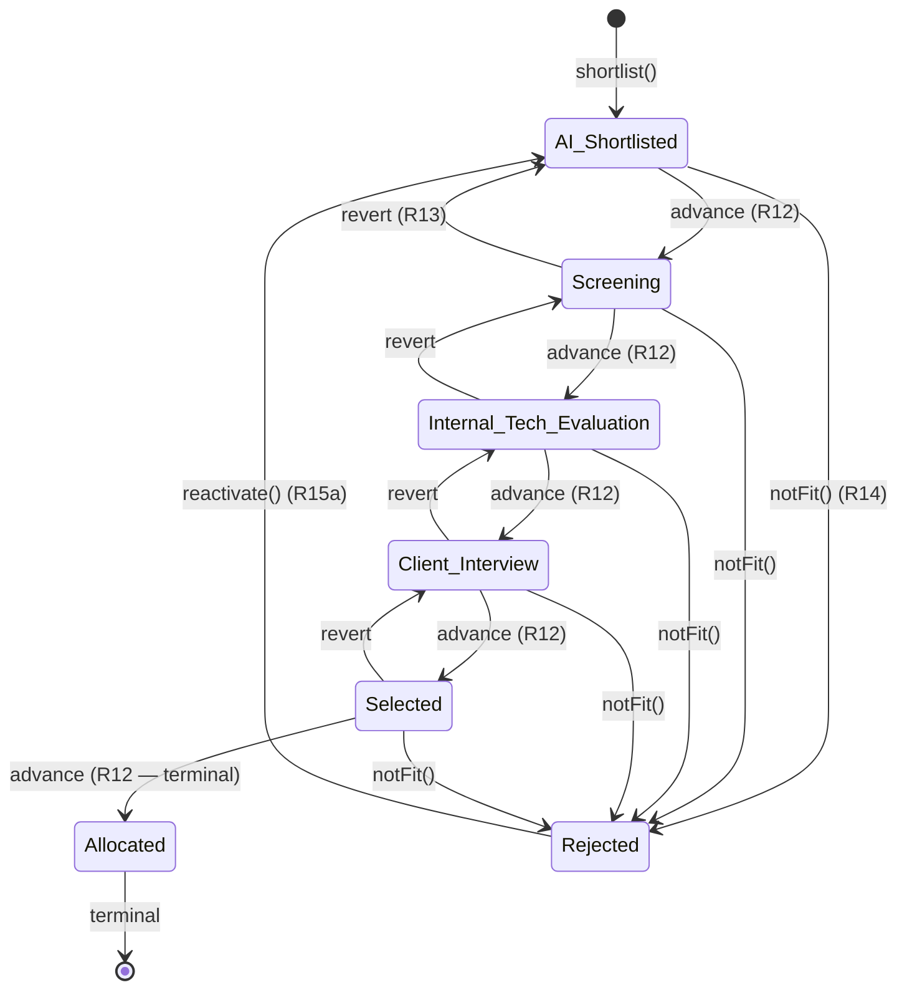

---

## 20. Feedback Architecture

### Storage
`FeedbackRound` table — one row per feedback submission. Fields:
- `roundName` — the pipeline stage at which feedback was given
- `interviewer` — name of the interviewer (set to the logged-in user's name)
- `roundDate` — optional datetime
- `rating` — e.g., "Strong yes", "Yes", "Maybe"
- `comments` — free-text feedback

### Relationship
Each `FeedbackRound` is linked to a `PipelineCandidate` via `pipelineCandidateId`. Multiple rounds can exist for the same candidate/stage.

### Retrieval
`GET /pipeline/:id/feedback` returns all rounds ordered by `roundDate DESC`. The client-side `FeedbackHistoryModal` re-sorts them by stage order using the `PIPELINE_STAGES` constant.

### Candidate Access (R17, R20)
Candidates can view their own feedback via `GET /candidate/feedback`. The candidate-facing API returns feedback for their own `PipelineCandidate` entries only.

---

## 21. CSV Export Architecture

TalentLens AI has **two export mechanisms**, both producing CSV format. There is **no Excel/XLSX library** in use.

### Pool Export (Server-Side)
`GET /pool?export=csv` triggers `PoolService.exportCsv()`:
- Fetches all matching employees (no pagination limit)
- Generates CSV string in memory: `Employee Code, Name, Role, BU, Location, Exp (yrs), Status, Skills, Available Date`
- Returns `Content-Type: text/csv` with `Content-Disposition: attachment; filename="pool.csv"`

### Pipeline Export (Client-Side — Enhanced)
`PipelinePage` has a client-side "Export" button:
- Iterates over `visibleByStage` (currently filtered + sorted pipeline entries)
- Columns: `Name, Role Title, Location, Stage, IRC Code, IRC Role, Match %, Applied Date` + **one feedback column per pipeline stage**
- Stage feedback columns: `AI Shortlisted Feedback`, `Screening Feedback`, `Internal Tech Evaluation Feedback`, `Client Interview Feedback`, `Selected Feedback`, `Allocated Feedback`
- Each feedback cell contains all `FeedbackRound` records for that stage, concatenated with newlines (date + rating + comments per record)
- Feedback data is available in the pipeline list response (`feedbackRounds` is now included in `GET /pipeline`)
- Uses `URL.createObjectURL(new Blob(...))` and programmatic anchor click

### AI Search Export (Client-Side)
`AISearchPage` has a client-side "Export" button:
- Exports the currently visible (filtered + sorted + count-limited) ranked results
- Columns: `Name, Role, BU, Location, Exp (yrs), Match %, Why Recommend, Skills, Available Date, In Pipeline`

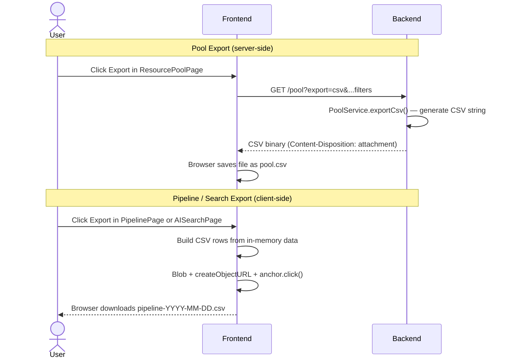

---

## 22. Candidate Profile & GLO Integration

### Profile Page
`GET /employees/:id` returns full profile including `email`, skills, career history, performance ratings, and (for non-candidates) active pipeline entries. The `CandidateProfilePage` renders this at `/employees/:id`.

### GlobalLogic GLO Profile Redirect — Now Implemented
Employee `email` is now exposed in search results and pipeline entries via `EmployeesService` and `SearchService.rehydrate()`. The email is sourced from the linked `User` record (`employee.user.email`).

GLO profile URL construction:
```
employee.email = "john.doe@globallogic.com"
GLO URL       = "https://glo.globallogic.com/users/profile/john.doe"
               (username = segment before '@')
```

The seed (`server/prisma/seed.ts`) creates `User` accounts for all seeded employees with their real `@globallogic.com` email addresses, enabling GLO profile linking for the demo dataset. The email field is `null` for employees without a linked User account.

---

## 23. API Architecture

### Base URL
`http://localhost:3001` (default). Configured via `VITE_API_URL` on the frontend and `PORT` on the backend.

All responses are wrapped: `{ data: T }` via `TransformInterceptor`.

### Authentication APIs

| Method | Endpoint | Auth | Purpose |
|--------|---------|------|---------|
| POST | `/auth/signup` | Public | Register and receive JWT |
| POST | `/auth/login` | Public | Email+password → JWT |
| POST | `/auth/demo-login/:role` | Public | Demo JWT (dev/demo only) |

### Project APIs

| Method | Endpoint | Auth | Purpose |
|--------|---------|------|---------|
| GET | `/projects` | Manager/HR | List projects (manager: own only) |
| GET | `/projects/:id` | Manager/HR | Project detail with IRC summary |
| GET | `/projects/:id/ircs` | Manager/HR | Full IRC list for a project |

### IRC APIs

| Method | Endpoint | Auth | Purpose |
|--------|---------|------|---------|
| GET | `/ircs/:id` | Manager/HR | Full IRC detail (used by AI Search) |

### Employee APIs

| Method | Endpoint | Auth | Purpose |
|--------|---------|------|---------|
| GET | `/employees/:id` | Any authenticated | Full profile (pipeline hidden from candidates) |

### AI Search APIs

| Method | Endpoint | Auth | Purpose |
|--------|---------|------|---------|
| POST | `/search` | Manager/HR | AI-ranked candidates for an IRC |
| POST | `/search/upload-jd` | Manager/HR | Upload 1–5 PDF/DOCX JD files → extract + concatenate text → search |
| POST | `/search/embed-all` | HR only | Bulk re-embed all employee profiles (pgvector) |

### Pipeline APIs

| Method | Endpoint | Auth | Purpose |
|--------|---------|------|---------|
| GET | `/pipeline` | Manager/HR | List entries with filters + pagination |
| POST | `/pipeline` | Manager/HR | Shortlist a candidate to an IRC |
| PATCH | `/pipeline/:id` | Manager/HR | Move stage forward or backward |
| POST | `/pipeline/:id/not-fit` | Manager/HR | Reject with reason |
| POST | `/pipeline/:id/reactivate` | Manager/HR | Re-admit rejected candidate |
| GET | `/pipeline/:id/feedback` | Manager/HR | Get feedback rounds |
| POST | `/pipeline/:id/feedback` | Manager/HR | Add feedback round |
| GET | `/pipeline/:id/history` | Manager/HR | Stage transition history |

### Pool APIs

| Method | Endpoint | Auth | Purpose |
|--------|---------|------|---------|
| GET | `/pool` | Manager/HR | Paginated employee pool with filters (`forecasted=true` for Forecast to Pool) |
| GET | `/pool?export=csv` | Manager/HR | Download pool as CSV |

### Candidate APIs

| Method | Endpoint | Auth | Purpose |
|--------|---------|------|---------|
| GET | `/candidate/open-ircs` | Candidate | Open IRCs with `hasApplied` flag |
| POST | `/candidate/apply/:ircId` | Candidate | Apply to an open IRC |
| GET | `/candidate/my-pipeline` | Candidate | Own pipeline entries with stages + feedback |
| GET | `/candidate/feedback` | Candidate | All received feedback rounds |
| GET | `/candidate/upcoming` | Candidate | Future-dated interview rounds |

### Notification APIs

| Method | Endpoint | Auth | Purpose |
|--------|---------|------|---------|
| GET | `/notifications` | Any authenticated | All notifications for logged-in user |
| PATCH | `/notifications/mark-seen` | Any authenticated | Mark all as seen |
| PATCH | `/notifications/:id/seen` | Any authenticated | Mark single notification as seen |

### Health API

| Method | Endpoint | Auth | Purpose |
|--------|---------|------|---------|
| GET | `/health` | Public | Liveness check |

---

## 24. Detailed API Specifications

### `POST /search`

**Purpose:** Submit a natural-language search query against an open IRC and receive AI-ranked candidate results.

**Authentication:** Bearer JWT — Manager or HR role required.

**Request Body:**
```json
{
  "ircId": 12,
  "scope": "all",
  "query": "Python engineers with payments experience",
  "jdText": "Optional pre-extracted job description text"
}
```

**Response:**
```json
{
  "data": [
    {
      "employeeId": 45,
      "fullName": "Jane Smith",
      "roleTitle": "Senior Software Engineer",
      "location": "Bangalore",
      "businessUnit": "Financial Services",
      "experienceYears": 6,
      "skills": ["Python", "FastAPI", "PostgreSQL"],
      "currentAllocation": null,
      "availableDate": "2026-09-01",
      "matchPct": 87,
      "whyRecommend": "Python and FastAPI recorded; project evidence in settlement automation APIs.",
      "whyNot": ["No direct Kubernetes experience."],
      "conflict": true,
      "conflictNote": "Available 2026-09-01 — check joining timeline against project start",
      "isDuplicate": false,
      "duplicateNote": null,
      "alreadyInPipeline": false,
      "pipelineCandidateId": null
    }
  ]
}
```

**Error Responses:**
- `400` — IRC not found or IRC is not Open
- `401` — Missing or invalid JWT
- `403` — Insufficient role
- `422` — Manager query is outside IRC/JD scope (validation failed)

---

### `POST /search/upload-jd`

**Purpose:** Upload 1–5 PDF or DOCX Job Description files; text is extracted from each file server-side, concatenated, and used as search context.

**Authentication:** Bearer JWT — Manager or HR role required.

**Content-Type:** `multipart/form-data`

**Form Fields:**
- `files` (required) — 1–5 binary PDF/DOCX files, max 5 MB each (field name must be `files`)
- `ircId` (required) — integer
- `scope` (required) — `"all"` | `"applied"`
- `query` (optional) — additional free-text refinement

**Response:** Same schema as `POST /search` (includes `email` field per candidate)

**Error Responses:**
- `400` — No valid files uploaded, wrong type, or IRC not Open
- `422` — Query/JD outside IRC scope

---

### `POST /pipeline`

**Purpose:** Shortlist an employee into an IRC pipeline at `AI Shortlisted` stage.

**Request Body:**
```json
{ "employeeId": 45, "ircId": 12 }
```

**Response:** Pipeline entry row with employee and IRC summary.

**Error Responses:**
- `400` — IRC not Open
- `403` — Manager doesn't own the project
- `404` — Employee or IRC not found
- `409` — Candidate already active in pipeline for this IRC

---

### `PATCH /pipeline/:id`

**Purpose:** Move a pipeline entry exactly one stage forward or backward.

**Request Body:**
```json
{
  "stage": "Screening",
  "direction": "forward",
  "note": "Optional — required UX note for backward moves"
}
```

**Error Responses:**
- `400` — Invalid stage transition (not exactly ±1 step), or `Allocated` terminal
- `403` — Access denied (manager / project ownership)
- `404` — Entry not found

---

## 25. API Error Handling

### Global Exception Filter (`GlobalExceptionFilter`)
All unhandled exceptions are caught and normalised to a consistent error shape. NestJS HTTP exceptions (e.g., `NotFoundException`, `ForbiddenException`) are passed through with their status codes. Prisma errors are mapped appropriately (`P2002` → 409, `P2025` → 404).

### Validation Errors (`ValidationPipe`)
Class-validator DTOs with `whitelist: true, forbidNonWhitelisted: true` — returns `400 Bad Request` with field-level error messages on invalid input.

### Application-Level Error States

| Scenario | HTTP Status | Client Behaviour |
|----------|------------|-----------------|
| Wrong credentials | 401 | Form error message |
| Expired/invalid token | 401 | Auto-redirect to /login (Axios interceptor) |
| Insufficient role | 403 | Error banner |
| Resource not found | 404 | Error banner or empty state |
| Duplicate pipeline entry | 409 | Error in modal |
| Query scope mismatch | 422 | Mismatch banner on search page |
| LLM unavailable | 500 (caught) | Heuristic fallback — search still returns |
| File parse failure | 400 | Client shows upload error |
| Empty search results | 200 + `[]` | "No matches found" empty state |

### LLM Failure Handling
`SearchService` wraps `LlmService.rank()` in a try/catch. On any failure (timeout, empty response, JSON parse error), it silently falls back to `HeuristicService.rank()`. The fallback is logged at WARN level. The user receives ranked results regardless.

---

## 26. External Integrations

### Ollama LLM Service

| Attribute | Value |
|-----------|-------|
| Purpose | Candidate ranking + query validation + optional embeddings |
| Direction | Backend → Ollama |
| Endpoints | `POST /api/chat` (ranking/validation), `POST /api/embed` (embeddings) |
| Auth | Optional `Authorization: Bearer <LLM_API_KEY>` header |
| Default model | `qwen3.5:9b` (configurable via `LLM_MODEL`) |
| Embedding model | `nomic-embed-text` (configurable via `EMBEDDING_MODEL`) |
| Base URL | `LLM_BASE_URL` env var (required) |
| Failure handling | Heuristic fallback for ranking; exception for embeddings (graceful skip) |

**Note:** Ollama is expected to run locally or on a network-accessible host. It is not a cloud SaaS; no API key is mandatory for local deployments.

---

## 27. Infrastructure Architecture

No Docker files, cloud configuration, CI/CD pipelines, proxy/gateway configuration, or deployment manifests were found in the repository.

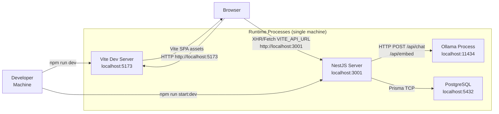

**Architecture Observation:** The current codebase is configured for local development only. There is no production deployment configuration present. Both the React dev server and NestJS run as separate processes, with the React app communicating directly to the backend via `VITE_API_URL`.

---

## 28. Environment & Configuration Management

### Backend Environment Variables (`server/.env`)

| Variable | Purpose | Required |
|----------|---------|----------|
| `DATABASE_URL` | PostgreSQL connection string | Yes |
| `JWT_SECRET` | HMAC signing key (min 16 chars) | Yes |
| `LLM_BASE_URL` | Ollama base URL | Yes |
| `LLM_API_KEY` | Bearer token for LLM (optional for local Ollama) | No |
| `LLM_MODEL` | Model name (default: `qwen3.5:9b`) | No |
| `LLM_SEED` | Deterministic seed (default: `42`) | No |
| `RANKING_PROVIDER` | `llm` or `heuristic` (default: `llm`) | No |
| `EMBEDDING_PROVIDER` | `none` or `ollama` (default: `none`) | No |
| `EMBEDDING_BASE_URL` | Embedding server base URL (default: `http://localhost:11434`) | No |
| `EMBEDDING_MODEL` | Embedding model name (default: `nomic-embed-text`) | No |
| `PORT` | Backend listen port (default: `3001`) | No |
| `CLIENT_URL` | CORS allowed origin (default: `http://localhost:5173`) | No |

### Frontend Environment Variables (`client/.env`)

| Variable | Purpose | Default |
|----------|---------|---------|
| `VITE_API_URL` | Backend API base URL | `http://localhost:3001` |

### Configuration Validation
`app.module.ts` uses Joi to validate all required environment variables at startup. Missing or invalid `DATABASE_URL`, `JWT_SECRET`, or `LLM_BASE_URL` will prevent the server from starting.

---

## 29. Security Architecture

### Implemented Protections

| Control | Implementation |
|---------|---------------|
| Authentication | JWT Bearer tokens (`JwtAuthGuard` on all routes) |
| Authorisation | Role-based guards (`RolesGuard` + `@Roles` decorator) |
| Password hashing | bcryptjs, configurable rounds |
| User enumeration prevention | Constant-time bcrypt comparison even when user not found |
| Security headers | `helmet` middleware (X-Content-Type-Options, HSTS, etc.) |
| Rate limiting | 200 req / 15 min via `express-rate-limit` |
| CORS | Dynamic origin function — allows any `localhost:*` origin (dev convenience); `credentials: true` |
| Input validation | NestJS `ValidationPipe` — whitelist mode, DTOs with class-validator |
| SQL injection | Prisma ORM with parameterised queries; `$queryRawUnsafe` used only where `pgvector.toSql()` produces only floats/commas (noted in code) |
| Project ownership | Manager can only access/modify their own projects and IRCs (R18) |
| Pipeline isolation | Candidates cannot see other employees' pipeline data (R20) |
| File validation | multer MIME type filter + 5 MB size limit |
| Token revocation | Live DB lookup in `JwtStrategy.validate()` on every request |
| Client-side token expiry | `decodeJwt()` checks `exp * 1000 < Date.now()` on load |

### Security Considerations / Recommendations

| Risk | Recommendation |
|------|---------------|
| `localStorage` token storage | Consider `httpOnly` cookie with CSRF protection for production |
| No HTTPS enforcement | Add TLS termination at the reverse proxy layer for production |
| Demo login endpoint | `POST /auth/demo-login/:role` should be disabled in production |
| `$queryRawUnsafe` | The single usage constructs the vector string from `pgvector.toSql()` which is safe, but should be reviewed if the function changes |
| AI prompt content | Employee project history and skills are included in LLM prompts — consider data classification review |

---

## 30. AI Security & Reliability

### Implemented Mitigations

| Concern | Implementation |
|---------|---------------|
| Hallucinated employeeIds | Post-ranking filter: IDs not present in submitted pool are silently dropped |
| Malformed JSON from LLM | JSON sanitisation (strip `<think>` blocks, comments, trailing commas) + Zod validation + one automatic retry |
| LLM response schema violation | Zod `catch()` coercions provide safe defaults (`matchPct` defaults to 50, `whyRecommend` gets fallback text) |
| LLM total failure | Automatic heuristic fallback — user always receives ranked results |
| Out-of-scope queries | Pre-ranking LLM validation (domain check, skill check, numeric check); validation failure does not block on LLM unavailability |
| Skill hallucination | Prompt explicitly instructs: "Never invent skills"; "Every statement must come from the SAME candidate's input record" |
| Display field trust | Re-hydration step: all display fields (name, role, skills) loaded from DB after ranking — never from model output |
| Prompt injection via JD | JD text is capped at `JD_TEXT_MAX_LENGTH` and passed as JSON data — not concatenated into free-text instructions |

### Heuristic Fallback Scoring
The fallback service scores candidates by mandatory-skill overlap, capped at **85%** to prevent artificially displacing evidence-based LLM scores when the LLM eventually becomes available.

---

## 31. Performance Considerations

### Current Implementation

| Area | Observation |
|------|------------|
| LLM ranking latency | Synchronous HTTP call to Ollama; response time varies with model size and candidate pool. Context window set to 16 384 tokens. |
| Candidate pool size | `scope=all` sends the full employee table to the LLM. With many employees, prompt size grows proportionally. |
| Vector pre-filter | Optional pgvector pre-filter can reduce pool before LLM (controlled by `VECTOR_PRE_FILTER_LIMIT` constant). |
| Dashboard queries | Two parallel queries; KPIs derived client-side. No server-side aggregation. |
| Pipeline list | Paginated (`default limit=20`, max `100`). |
| Pool list | Paginated with server-side filters. CSV export has no pagination (all rows). |
| DB queries | Prisma N+1 avoided via `include` relationships. Count + data fetched with `Promise.all`. |
| Search log | Async write after ranking completes (does not delay response). |

### Recommendations
- Add a `VECTOR_PRE_FILTER_LIMIT` threshold so large pools benefit from pgvector pre-filtering
- Add DB indexes on `Employee.benchStatus`, `Employee.location`, `PipelineCandidate.stage`
- Consider streaming the LLM response for large pools (currently `stream: false`)

---

## 32. Scalability Considerations

| Concern | Current Behaviour | Impact |
|---------|-----------------|--------|
| Candidate pool growth | All non-rejected employees sent to LLM in one prompt | Prompt exceeds context window with very large employee base |
| Concurrent searches | Each search is a synchronous Ollama call; concurrent requests queue behind Ollama's single-thread model execution | High latency under concurrent load |
| Dashboard aggregation | Done client-side from up to 100 pipeline entries | Becomes inaccurate/slow as pipeline grows |
| Notification delivery | Synchronous DB insert inside mutation handlers | Does not block but adds latency to every stage change |
| Pool CSV export | No row limit — fetches all matching employees | Memory pressure with very large employee directories |

---

## 33. Observability & Logging

### Backend Console Logging
NestJS `Logger` is used in `SearchService`, `LlmService`, and `EmbeddingService`. Key log events:
- Pool size + scope + query before ranking
- LLM response metadata (model, tokens, done reason, content preview)
- Top-3 ranked candidates after ranking
- Fallback activations (LLM failure → heuristic)
- Vector pre-filter result counts
- Embedding startup job status

### File Logging
`writeSearchLog()` utility writes detailed search debug entries to `server/logs/latest-candidate-pool.json`. Entries include: full LLM prompt (`phase: 'llm-prompt'`), full LLM response (`phase: 'llm-response'`), and final ranking results.

### Database Audit
`SearchLog` table records every search execution (user, IRC, query text, JD filename, timestamp).
`PipelineStageHistory` provides an immutable audit trail of every stage change (actor, from, to, reason, timestamp).

### Monitoring / APM
**Not currently implemented.** No APM, error tracking (Sentry, etc.), metrics exporter, or structured logging integration exists in the repository.

---

## 34. Deployment Flow

Based on repository analysis, the current deployment flow is:

```
Developer
  → git clone / pull
  → cd server && npm install
  → DATABASE_URL=... LLM_BASE_URL=... npx prisma migrate deploy
  → npx prisma db:seed   (optional — demo data)
  → npm run start:prod   (NestJS server on PORT)

  → cd client && npm install
  → VITE_API_URL=http://<server>:3001 npm run build
  → Serve dist/ with any static file server (nginx, serve, etc.)

  → Ensure Ollama is running with qwen3.5:9b pulled
  → Ensure PostgreSQL is running with pgvector extension installed
```

No automated CI/CD pipeline was found in the repository.

---

## 35. End-to-End Functional Data Flows

### Flow A — HR/Manager Login

```mermaid
flowchart LR
    User["User"] -->|Enter email+password| LoginPage
    LoginPage -->|POST /auth/login| API["NestJS API"]
    API -->|bcrypt.compare| DB["PostgreSQL"]
    DB -->|user row| API
    API -->|JWT { sub, role, name }| LoginPage
    LoginPage -->|store token localStorage| AuthContext
    AuthContext -->|redirect /dashboard| RoleDashboard["Role-specific Dashboard"]
```

---

### Flow C — AI Candidate Search (Full)

```mermaid
flowchart TD
    Manager["Manager"] -->|Select IRC + type query| SearchComposer
    SearchComposer -->|"POST /search { ircId, query, scope }"| SearchController
    SearchController --> SearchService

    SearchService -->|"Load IRC + validate status=Open"| DB
    SearchService -->|"LLM validateQuery (if query + context)"| LlmService
    LlmService -->|"POST /api/chat (validation)"| Ollama

    SearchService -->|"Build pool (all/applied scope)"| DB
    SearchService -->|"pgvector pre-filter (if enabled)"| DB

    SearchService -->|"buildPrompt + rank"| LlmService
    LlmService -->|"POST /api/chat (ranking)"| Ollama
    Ollama -->|"JSON RankedItem[]"| LlmService
    LlmService -->|"Zod validate + sanitise"| SearchService

    SearchService -->|"Rehydrate display fields"| DB
    SearchService -->|"Duplicate + pipeline checks"| DB
    SearchService -->|"Sort by matchPct DESC"| SearchService
    SearchService -->|"Write SearchLog"| DB
    SearchService -->|SearchResult[]| SearchController
    SearchController -->|"{ data: SearchResult[] }"| SearchComposer
    SearchComposer -->|"Render ResultCard[]"| Manager
```

---

### Flow E — Candidate Pipeline Stage Advance

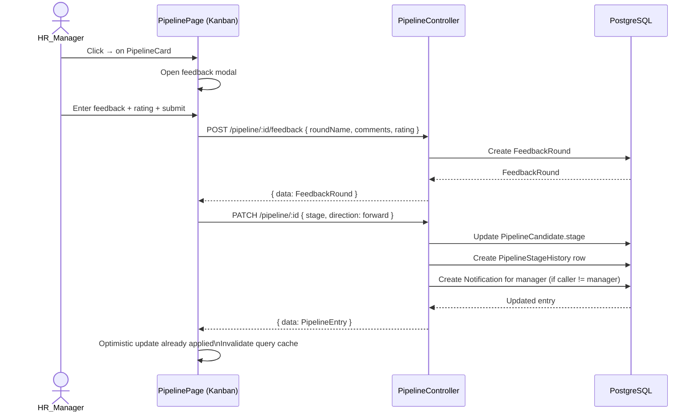

---

### Flow G — Dashboard Data Aggregation

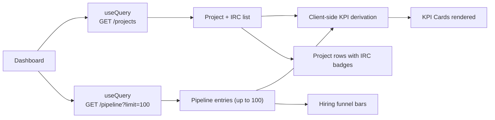

---

## 36. Architecture Decision Summary

| Area | Current Decision | Reason / Observation |
|------|-----------------|---------------------|
| Frontend | React SPA with TanStack Query | No SSR needed; server-state management via query cache |
| Backend | NestJS (modular) | Structured DI, decorator-driven, TypeScript-first |
| Database | PostgreSQL + Prisma | Type-safe ORM; pgvector extension for future embedding search |
| LLM integration | Ollama REST API | Local LLM execution; no cloud API costs; model-swappable via env |
| LLM model | `qwen3.5:9b` (default) | Compact, fast local model supporting structured JSON output |
| JSON safety | Ollama `format` schema + Zod | Constrained output + application-side validation |
| LLM fallback | Synchronous heuristic service | Ensures search always returns even when LLM unavailable |
| Authentication | JWT + bcrypt | Stateless; 7-day tokens with live DB role validation |
| File parsing | pdf-parse + mammoth (in-memory) | No disk writes; supports PDF and DOCX |
| Export | CSV only (no Excel library) | Lightweight; browser-native for pipeline/search; server-side for pool |
| Notifications | Database-backed (polling) | Simple; no WebSocket or SSE complexity |
| Embeddings | Optional pgvector (disabled by default) | Phase 2 capability; does not affect Phase 1 behaviour |
| Role scoping | Server-enforced WHERE clauses | Manager project isolation enforced at DB query level, not UI only |

---

## 37. Current Architecture vs Future Enhancements

### Current Architecture (Confirmed from Repository)
- Local Ollama LLM for ranking and optional embeddings
- Synchronous heuristic fallback
- Optional pgvector pre-filter (disabled by default)
- Single NestJS process, single PostgreSQL instance
- CSV exports (pool: server-side; pipeline/search: client-side)
- In-database notification model
- No caching layer, no message queues, no background workers

### Future / Recommended Architecture

The following are **not currently implemented** — they are architectural recommendations for production scale:

| Enhancement | Description |
|-------------|-------------|
| **Always-on pgvector pre-filter** | Enable `EMBEDDING_PROVIDER=ollama` to reduce LLM context size for large employee directories |
| **Async LLM ranking** | Move Ollama call to a background job (BullMQ + Redis); return a job ID to the frontend; poll or use SSE for results |
| **Redis caching** | Cache search results keyed by `(ircId, queryHash, scopeHash)` with short TTL to reduce repeat LLM calls |
| **Background embedding updates** | Re-embed profiles on skill/history changes via a job queue instead of on-demand |
| **Server-side dashboard aggregation** | Pre-compute KPI metrics on the server to avoid sending 100 pipeline entries to the client |
| **HTTPS + reverse proxy** | nginx/caddy in front of both NestJS and Vite build |
| **APM + structured logging** | Pino + OpenTelemetry for trace correlation across LLM calls |
| **Excel export** | Use `exceljs` for pipeline export with stage-wise feedback columns |
| **Webhook notifications** | Email or Slack notification on stage changes, instead of in-app only |
| **Docker Compose** | Containerise NestJS + Postgres + Ollama for reproducible local and CI environments |

---

## 38. Proposed Future AI Search Architecture

> **Future / Proposed Architecture — Not Current Implementation**

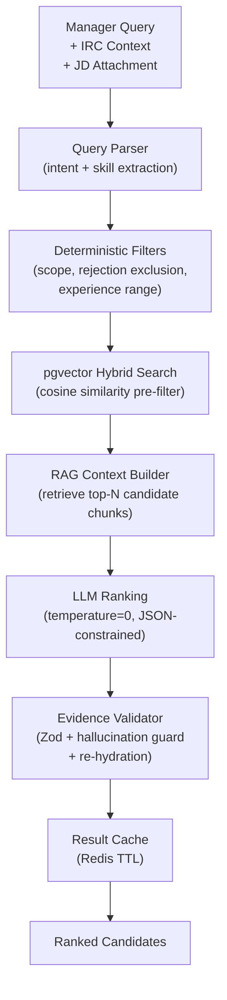

This proposed architecture builds on the current implementation by adding: RAG pre-retrieval using embeddings, Redis result caching, and an explicit query parser layer for complex multi-constraint queries.

---

## 39. Key Architecture Risks

| Risk | Impact | Existing Mitigation | Recommendation |
|------|--------|-------------------|----------------|
| LLM response latency (10–30s for large pools) | Poor UX during search | StepProgress indicator; heuristic fallback | Async LLM job with polling |
| LLM context window overflow (large pools) | Incomplete ranking / silent truncation | `num_ctx=16384`; pgvector pre-filter available | Enable pgvector pre-filter; add pool size cap |
| LLM hallucinated employeeIds | Wrong candidates shown | Pool ID filtering after ranking | No additional action needed — current guard is sufficient |
| Single Ollama process bottleneck | Search fails under concurrent load | Heuristic fallback on error | Run multiple Ollama replicas; async queue |
| Plaintext JD content in LLM prompt | Potentially sensitive JD data sent to Ollama | JD text capped at `JD_TEXT_MAX_LENGTH` | Review data classification policy |
| JWT in localStorage | XSS can steal token | Axios auto-logout on 401; live role check on every request | Use httpOnly cookie + CSRF token for production |
| CORS allows all localhost origins | Any localhost port accepted in dev | Acceptable for local dev; no cross-origin risk on a local machine | Restrict to specific origin(s) for production |
| No production deployment config | Manual deployment; no rollback mechanism | Not applicable | Add Docker Compose + CI/CD pipeline |
| Large pool CSV export (no row limit) | Memory pressure on large directories | Pagination applied only to `findAll`; export bypasses it | Add row cap on CSV export or stream response |

---

## 40. Architecture Summary

TalentLens AI is a **two-tier React + NestJS application** backed by PostgreSQL with an optional pgvector extension.

**How candidate search works:** A Manager selects an IRC (job requisition), optionally uploads a JD document, and enters a natural-language requirement. The `SearchService` builds a candidate pool from the employee database, optionally pre-filters it using vector similarity, then sends the pool to a local LLM (Ollama, `qwen3.5:9b`) with a structured 10-step ranking prompt. The LLM filters and scores candidates with evidence from their project history. If the LLM fails for any reason, a synchronous heuristic fallback ranks by mandatory-skill overlap (capped at 85%). All display fields are re-hydrated from the database — the model only supplies scores and reasoning.

**How AI is integrated:** The LLM runs locally via Ollama's REST API. The prompt constrains output to a JSON schema using Ollama's `format` parameter. Response safety is provided by Zod schema parsing with coercion, plus sanitisation for common LLM formatting artefacts. Query scope is validated before ranking to detect off-topic or contradictory requests.

**How candidates move through the pipeline:** After shortlisting, candidates progress through: `AI Shortlisted → Screening → Internal Tech Evaluation → Client Interview → Selected → Allocated`. Each forward move requires a mandatory feedback entry. Backward moves require a reason note. Rejection via "not a fit" is a terminal action that preserves the record and disallows re-entry without an explicit reactivation call.

**How data is persisted:** PostgreSQL via Prisma ORM. The schema is fully relational with explicit M:N joins, soft-delete for rejected pipeline entries, and an immutable stage history audit table. An optional `vector(768)` embedding column on `Employee` supports future pgvector-based pre-filtering.

**How the three roles interact:** HR has org-wide visibility and manages pool imports. Managers drive AI Search and pipeline decisions, scoped strictly to their own projects. Candidates browse open IRCs, apply, and track their own pipeline status and feedback — they cannot see other employees' pipeline data.

---

## Document Completion Summary

| Item | Detail |
|------|--------|
| **Document path** | `docs/ARCHITECTURE.md` |
| **Major components** | React SPA, NestJS API (9 feature modules), PostgreSQL + pgvector, Ollama LLM, 4-service AI Search layer |
| **APIs documented** | 28 endpoints across 8 API groups |
| **Architecture diagrams** | 12 Mermaid diagrams (system context, high-level, auth sequence, ERD, AI search sequence, pipeline state, file attachment, dashboard, export, infrastructure, future AI, login flow) |
| **Unconfirmed areas** | Production deployment topology; CI/CD pipeline |
| **v1.1 changes** | Multiple JD file uploads; employee email + GLO profile links (now implemented); feedbackRounds in pipeline list; stage-wise feedback CSV export; enhanced dashboard KPIs with deep-link cards; Forecast to Pool filter; result count options (Top 5/10/50/Custom); URL param stage pre-filter for pipeline; CORS updated to allow any localhost |
